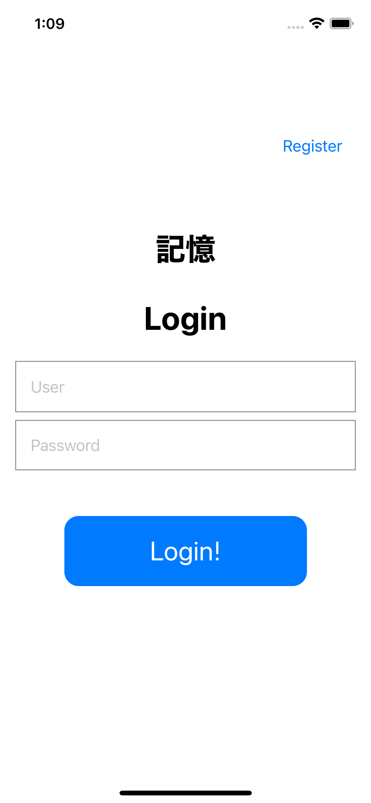
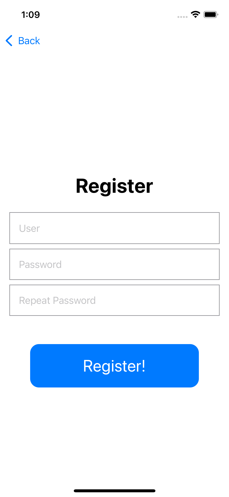
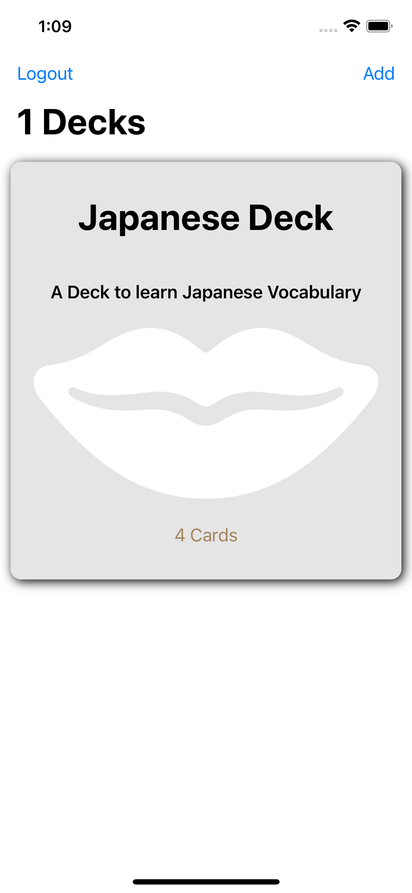
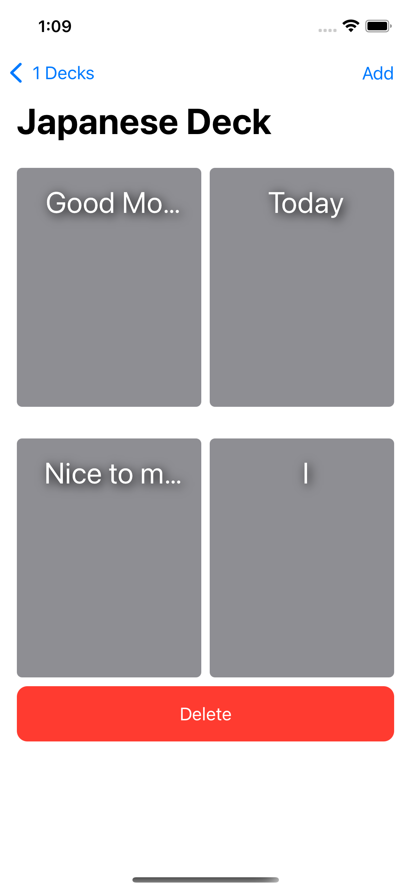

# Flash Card Memory App

Simple flash card application to help memorize things. These apps are useful while learning a wide range of subjects. I use them to learn new languages.

| Login         | Register     | 
|--------------|-----------|
|  |       | 
| Decks         | Cards     | 
|       |   | 

## App Use Cases

- The app will have login / logout / register capabilities, as the user will need to store the cards for later review.
- The user should be able to create as many Decks of Cards as needed
- Also, editing a Deck and deleting a Deck will be needed
- Once created, Decks will be show ordered by last update date. Changing order is not included in this prototype.
- Filtering is not included in this prototype.
- We can see the content of a Deck. Each Deck can contain as many Cards as we want. Cards will be show ordered by last update date.
- We can CRUD Cards
- We can use a Deck to test our knowledge, showing the front face of each card, on tap showing the back. Next card can be shown. This can be at random or one after another.

## Purpose of this app as a Learning Resource

This app has several objectives, as a learning resource
- show __how to structure an iOS app using separate layers__
- show how to write those layer so we can __easily change implementations__ (modular approach)
- use Realm to drive our Repositories

To show all that, we'll follow this journey:
- we'll start using a simple repositoriy with a fake cache / networking layer. This won't be fully implemented. For that Repository to work we need to take care of:
    - networking
    - threading
    - maintaining a cache (CRUD of all our objects, creating a file or using a DB, etc.)
    - invalidating that cache "is my local data more up to date than data in the server?"
    - syncing: what happens when other user makes changes to data I also have access to?
    - permission checking
    - JSON mapping into Entities, both down (from the app to cache and network) and up (from JSON downloaded from the network to Entities and Models)
    - etc. etc.
- we'll replace all this for a simple repository implementation, using a local Realm. This won't have login/logout but will store everything locally
- finally, connect our app to a MongoDB Realm App that saves everything in a MongoDB Atlas Database.

## iOS App

### Building

- You need Xcode 13 to build this app. 
- Clone this repo with `git clone https://github.com/mongodb-developer/flash-cards-memory-app`
- Go to `iOS App/FlashCardsApp`
- Open `FlashCards.xcodeproj`

## MockServer

With the Fake, hand made repository we're using a Fake API server that always returns the same data. It's hosted [here](https://realmflashcards.netlify.app/api/decks.json) and it returns a JSON file with Decks and Cards (always the same one)

You can check these files in the `Server` folder.

## Android App
To be done

## Resources

To learn more about Realm/MongoDB you have all these fantastic resources:

- [💻 MongoDB DeveloperHub, central point for everything MongoDB/Realm related](https://www.mongodb.com/developer)
- [💬 The MongoDB Forums](https://www.mongodb.com/community/forums/)
- [👩‍💻 Developer Blog](https://developer.mongodb.com/learn/?content=Articles#main)
- [🎓 MongoDB University](https://university.mongodb.com/)
- [📺 Youtube Channel](https://www.youtube.com/c/MongoDBofficial)
- [🎧 The MongoDB Podcast](https://developer.mongodb.com/learn/?content=Podcasts#main)
- [🎧 Unicode U00D1 (in Spanish 🇪🇸) Podcast](https://twitter.com/UnicodeU00D1)
